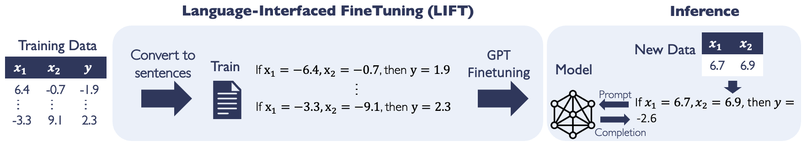

# LIFT: Language-Interfaced FineTuning for Non-Language Machine Learning Tasks

[Tuan Dinh](https://tuan-dinh.github.io/) *, [Yuchen Zeng](https://yzeng58.github.io/zyc_cv/) *, Ruisu Zhang, [Ziqian Lin](https://myhakureimu.github.io/), Michael Gira, [Shashank Rajput](https://pages.cs.wisc.edu/~srajput/), [Jy-yong Sohn](https://sites.google.com/view/jsohn), [Dimitris Papailiopoulos](https://papail.io/), [Kangwook Lee](https://kangwooklee.com/)

Advances in Neural Information Processing Systems 35 (NeurIPS 2022).
Links: [Paper](https://openreview.net/pdf?id=s_PJMEGIUfa),[Poster](https://nips.cc/media/PosterPDFs/NeurIPS%202022/54500.png?t=1669498072.6368294),[Video](https://nips.cc/virtual/2022/poster/54500)

This repository is the code implementation of paper *[LIFT: Language-Interfaced FineTuning for Non-Language Machine Learning Tasks](https://openreview.net/pdf?id=s_PJMEGIUfa)*.

## Abstract

Finetuning pretrained language models (LMs) has become a norm for learning various downstream tasks. While it is feasible to finetune LMs for language downstream tasks without making any architectural changes, most existing finetuning approaches for non-language tasks rely on task-specific designs for input, output layers, and loss functions. A natural question arises – Can language model finetuning solve non-language downstream tasks without changing models’ architecture or loss function? To answer this question, we study the efficacy and limitations of Language-Interfaced FineTuning (LIFT) for non-language tasks by conducting an extensive empirical study on a suite of non-language classification and regression tasks. LIFT does not make any changes to the model architecture or loss function, and it solely relies on the natural language interface, truly enabling "no-code machine learning with language models". We find that LIFT performs relatively well across a wide range of low-dimensional classification and regression tasks, matching the performances of the best models in many cases, especially for the classification tasks. We thoroughly study fundamental properties of LIFT, including the inductive bias, sample efficiency, ability to extrapolate, robustness to noises and corrupted labels, and adversarial robustness. We also analyze a few unique properties specific to LIFT – non-deterministic predictions and how to use them, and sample-efficient context-aware learning via appropriate prompting or two-stage finetuning. We provide discussions on limitations and open questions toward making LIFT more effective and efficient.

## Running the experiments

We have three categories of experiments: classification, regression, and others. Please read the manual under the three corresponding folders for running experiments. 
