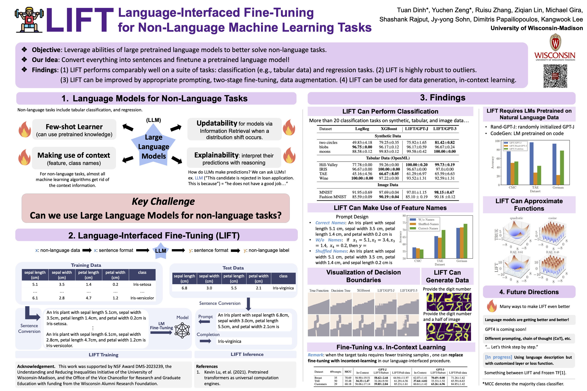

# LIFT: Language-Interfaced FineTuning for Non-Language Machine Learning Tasks

[Tuan Dinh](https://tuan-dinh.github.io/) *, [Yuchen Zeng](https://yzeng58.github.io/zyc_cv/) *, Ruisu Zhang, [Ziqian Lin](https://myhakureimu.github.io/), Michael Gira, [Shashank Rajput](https://pages.cs.wisc.edu/~srajput/), [Jy-yong Sohn](https://sites.google.com/view/jsohn), [Dimitris Papailiopoulos](https://papail.io/), [Kangwook Lee](https://kangwooklee.com/)

Advances in Neural Information Processing Systems 35 (NeurIPS 2022).

Links: [Paper](https://openreview.net/pdf?id=s_PJMEGIUfa), [Video](https://nips.cc/virtual/2022/poster/54500).

## Running the experiments

We have three categories of experiments: classification, regression, and others. Please read the manual under the three corresponding folders for running experiments. 
